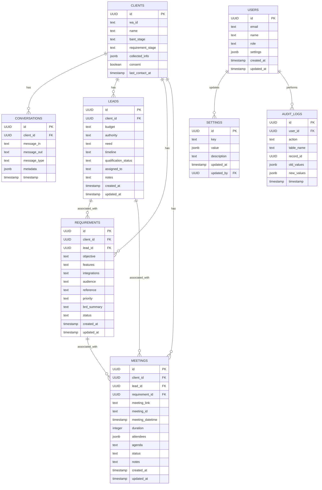

# Diagrama de Relaciones de Entidades (ERD)

Este diagrama muestra la estructura de la base de datos para la aplicación CRM de WhatsApp.

## Relaciones principales

1. Un **CLIENTE** puede tener muchas **CONVERSACIONES**
2. Un **CLIENTE** puede tener muchos **LEADS** (calificaciones BANT)
3. Un **CLIENTE** puede tener muchos **REQUERIMIENTOS**
4. Un **CLIENTE** puede tener muchas **REUNIONES**
5. Un **LEAD** puede estar asociado con muchos **REQUERIMIENTOS**
6. Un **LEAD** puede estar asociado con muchas **REUNIONES**
7. Un **REQUERIMIENTO** puede estar asociado con muchas **REUNIONES**
8. Un **USUARIO** puede actualizar muchas **CONFIGURACIONES**
9. Un **USUARIO** puede realizar muchas acciones registradas en **AUDIT_LOGS**

## Notas sobre la implementación

- Todas las relaciones están configuradas con `ON DELETE CASCADE` para mantener la integridad referencial.
- Se han creado índices para mejorar el rendimiento en consultas frecuentes.
- La tabla `SETTINGS` almacena configuraciones globales del sistema.
- La tabla `AUDIT_LOGS` registra cambios importantes para auditoría.